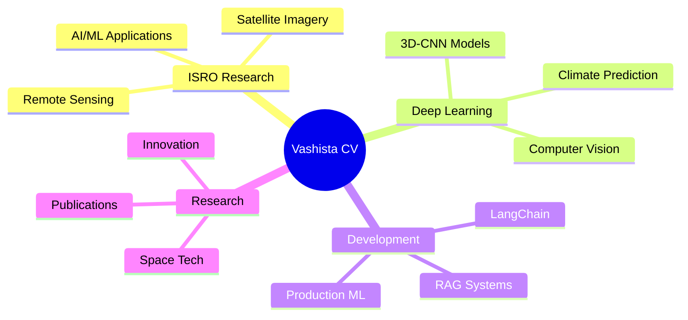

<h1 align="center">
  
</h1>

<p align="center">
  
  
  
</p>

<p align="center">
  <b>🛰️ Project Student @ ISRO-NRSC, Hyderabad | 🎓 B.E. CSE Final Year | 📄 Published Researcher</b>
</p>

---

## 🚀 About Me

```python
class VashistaCV:
    def __init__(self):
        self.name = "Vashista C V"
        self.role = "Project Student @ ISRO-NRSC"
        self.location = "Hyderabad, India"
        self.education = "B.E. Computer Science Engineering"
        self.institution = "Jain Institute of Technology, Davangere"
        
    def current_work(self):
        return {
            "organization": "ISRO-NRSC (National Remote Sensing Centre)",
            "focus": ["Satellite Imagery Analysis", "Remote Sensing", "AI/ML for Space Tech"],
            "duration": "Sep 2025 - Present"
        }
    
    def expertise(self):
        return {
            "core": ["Data Science", "Deep Learning", "Machine Learning"],
            "specializations": [
                "Computer Vision",
                "Spatio-Temporal Analysis",
                "Climate Data Modeling",
                "Cybersecurity",
                "Blockchain"
            ],
            "frameworks": ["TensorFlow", "PyTorch", "Keras", "Scikit-learn"],
            "languages": ["Python", "JavaScript", "SQL", "C++"]
        }
    
    def achievements(self):
        return [
            "🏆 1st Place - Mysterio 2025, JNNCE Shivamogga",
            "📄 Published in IJPREMS (Dec 2024)",
            "🛰️ Working on Satellite Data Processing at ISRO"
        ]
```

---

## 💼 Professional Experience

<table>
<tr>
<td width="50%">

### 🛰️ ISRO-NRSC
**Project Student** | *Sep 2025 - Present*
- Satellite data processing & analysis
- AI/ML for remote sensing applications
- Space technology research

</td>
<td width="50%">

### 🤖 AI/ML Internships
- **AICTE, Shell India & Edunet** *(Jul-Aug 2025)*
- **Motioncut** - Python Intern *(Feb-May 2025)*
- **Cognifyz Technologies** - ML Intern *(Nov-Dec 2024)*
- **Brainwave Matrix** - Data Science *(May-Jun 2024)*

</td>
</tr>
</table>

---

## 🔬 Featured Projects

### 🌧️ Deep Spatio-Temporal 3D-CNN for Rainfall Prediction
> **Active Development** | Climate Science & Deep Learning
- Architected deep learning model integrating satellite NetCDF climate data
- Implementing advanced spatio-temporal convolution layers
- Improving forecast accuracy for meteorological applications
- **Tech Stack:** Python, TensorFlow, 3D-CNN, NetCDF4, Climate Data Analysis

### 🌾 Samarth AI - Agricultural Intelligence System
> **Live:** [projectsamarth.vercel.app](https://projectsamarth.vercel.app)
- Production-ready RAG system with LangChain & LLMs
- Real-time agricultural advisory platform
- **Tech Stack:** LangChain, Python, Next.js, Vercel

### 🛡️ Self-Healing Cyber Defense System
> **🏆 1st Place Winner - Mysterio 2025**
- Autonomous threat detection and mitigation
- Real-time security response system
- **Tech Stack:** Python, Machine Learning, Cybersecurity

### 🔋 EV Charge Demand Prediction
> **R² Score: 0.94** | [GitHub Repository](https://github.com/vasistacv/EV_Charge_Demand_Prediction)
- Random Forest model for electric vehicle demand forecasting
- High-accuracy predictive analytics
- **Tech Stack:** Python, Scikit-learn, Pandas, Data Visualization

### 🎭 Deepfake Detection System
> **88% Accuracy** | Computer Vision & Deep Learning
- ResNet-CNN + LSTM hybrid architecture
- Real-time deepfake video detection
- **Tech Stack:** TensorFlow, OpenCV, ResNet, LSTM

### 🗳️ Privacy-Preserving Voting System
> **Published in IJPREMS (Dec 2024)**
- Blockchain-based secure voting with Elliptic Curve Cryptography
- Research paper on privacy and security in digital voting
- **Tech Stack:** Blockchain, ECC, Python, Cryptography

---

## 🛠️ Tech Stack

### Core Expertise
<p align="left">
  
  
  
  
</p>

### AI/ML & Data Science
<p align="left">
  
  
  
  
  
  
  
</p>

### Development & Tools
<p align="left">
  
  
  
  
  
  
</p>

### Specialized Skills
<p align="left">
  
  
  
  
  
</p>

---

## 📊 GitHub Statistics

<p align="center">
  
  
</p>

<p align="center">
  
</p>

<p align="center">
  
</p>

---

## 🏆 Achievements & Recognition

<p align="center">
  
</p>

- 🥇 **1st Place** - Mysterio 2025, JNNCE Shivamogga (Self-Healing Cyber Defense)
- 📄 **Published Researcher** - IJPREMS Journal (Privacy-Preserving Voting System)
- 🛰️ **ISRO Project Student** - National Remote Sensing Centre, Hyderabad
- 🎓 **Multiple Internships** - AICTE, Shell India, Edunet, Motioncut, Cognifyz, Brainwave Matrix

---

## 📈 Current Focus



---

## 📫 Connect With Me

<p align="center">
  <a href="https://linkedin.com/in/vashistacv">
    
  </a>
  <a href="mailto:vasisthamanju796@gmail.com">
    
  </a>
  <a href="https://github.com/vasistacv">
    
  </a>
  <a href="https://portfolio-vasistacv.vercel.app">
    
  </a>
</p>

---

<p align="center">
  
</p>

<p align="center">
  <i>⭐️ From <a href="https://github.com/vasistacv">vasistacv</a> - Building the future with AI, one commit at a time</i>
</p>
