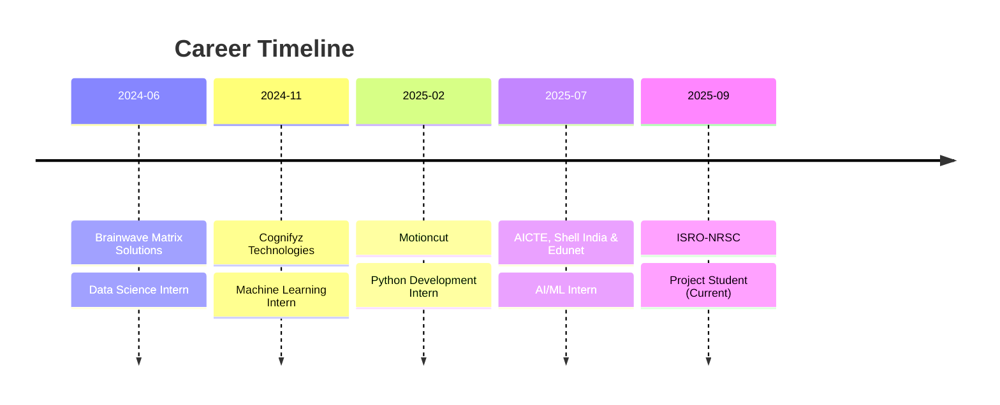

<div align="center">

# Vashista C V

[](https://git.io/typing-svg)


**Project Student @ ISRO-NRSC | B.E. CSE | Published Researcher**

</div>

## Professional Summary

```yaml
name: Vashista C V
role: Project Student
organization: ISRO-NRSC (National Remote Sensing Centre)
location: Hyderabad, India
education: B.E. Computer Science Engineering
institution: Jain Institute of Technology, Davangere
duration: September 2025 - Present

focus_areas:
  - Satellite Imagery Analysis
  - Remote Sensing Applications
  - AI/ML for Space Technology
  - Deep Learning Research
  - Climate Data Modeling

expertise_level:
  Data Science: Expert
  Deep Learning: Expert
  Machine Learning: Advanced
  Computer Vision: Advanced
  Cybersecurity: Intermediate
```

## Core Competencies

<table>
<tr>
<td width="50%" valign="top">

### Data Science & Analytics
- Statistical Analysis & Modeling
- Feature Engineering & Selection
- Data Visualization (Matplotlib, Seaborn, Plotly)
- Exploratory Data Analysis
- Predictive Modeling
- Time Series Analysis

### Deep Learning
- Neural Network Architectures
- Convolutional Neural Networks (CNNs)
- Recurrent Neural Networks (RNNs, LSTMs)
- 3D Convolutional Networks
- Transfer Learning
- Model Optimization & Deployment

</td>
<td width="50%" valign="top">

### Machine Learning
- Supervised Learning (Classification, Regression)
- Unsupervised Learning (Clustering, Dimensionality Reduction)
- Ensemble Methods (Random Forest, XGBoost, LightGBM)
- Model Evaluation & Validation
- Hyperparameter Tuning
- AutoML Techniques

### Specialized Domains
- Satellite Data Processing
- Remote Sensing Analysis
- Spatio-Temporal Modeling
- Climate Data Science
- Cryptography & Blockchain
- RAG Systems & LLMs

</td>
</tr>
</table>

## Technology Stack

<details>
<summary><b>Programming Languages</b></summary>
<br>


</details>

<details>
<summary><b>AI/ML Frameworks & Libraries</b></summary>
<br>


</details>

<details>
<summary><b>Development & DevOps</b></summary>
<br>


</details>

<details>
<summary><b>Specialized Tools & Technologies</b></summary>
<br>


</details>

## Professional Experience



### ISRO-NRSC, Hyderabad
**Project Student** | September 2025 - Present
- Satellite data processing and analysis using AI/ML techniques
- Remote sensing applications for environmental monitoring
- Research on spatio-temporal deep learning models
- Collaboration with scientists on space technology projects

### AICTE, Shell India & Edunet Foundation
**AI/ML Intern** | July 2025 - August 2025
- Machine learning model development for industry applications
- Collaborative projects with industry partners
- Advanced ML techniques and best practices

### Motioncut
**Python Development Intern** | February 2025 - May 2025
- Python application development and optimization
- Software engineering practices and code quality
- Full-stack development projects

### Cognifyz Technologies
**Machine Learning Intern** | November 2024 - December 2024
- ML model implementation and deployment
- Data analysis and visualization
- Predictive modeling projects

### Brainwave Matrix Solutions
**Data Science Intern** | May 2024 - June 2024
- Data preprocessing and exploratory analysis
- Statistical modeling and hypothesis testing
- Business intelligence and reporting

## Featured Projects

<table>
<tr>
<td width="50%">

### Deep Spatio-Temporal 3D-CNN for Rainfall Prediction
**Status:** Active Development  
**Domain:** Climate Science & Deep Learning

Architected a sophisticated deep learning model integrating satellite NetCDF climate data with ground-based observations for accurate rainfall prediction.

**Key Features:**
- Advanced 3D convolutional layers for spatio-temporal pattern extraction
- Integration of multiple satellite data sources
- High-resolution meteorological forecasting
- Scalable architecture for large-scale climate data

**Technologies:**
- Python, TensorFlow, 3D-CNN
- NetCDF4, Climate Data Analysis
- Satellite Data Processing

**Impact:** Improving forecast accuracy for meteorological applications and disaster management

</td>
<td width="50%">

### Samarth AI - Agricultural Intelligence System
**Status:** Production  
**Link:** [projectsamarth.vercel.app](https://projectsamarth.vercel.app)

Production-ready Retrieval-Augmented Generation (RAG) system providing real-time agricultural advisory to farmers using large language models.

**Key Features:**
- LangChain-based RAG architecture
- Real-time query processing
- Multi-language support
- Scalable vector database

**Technologies:**
- LangChain, Python
- Next.js, Vercel
- Vector Databases, LLMs

**Impact:** Empowering farmers with AI-driven agricultural insights

</td>
</tr>
<tr>
<td width="50%">

### Self-Healing Cyber Defense System
**Achievement:** 1st Place - Mysterio 2025, JNNCE Shivamogga

Autonomous cybersecurity system with real-time threat detection and self-healing capabilities.

**Key Features:**
- Autonomous threat detection
- Real-time mitigation strategies
- Self-healing mechanisms
- Adaptive security protocols

**Technologies:**
- Python, Machine Learning
- Cybersecurity Tools
- Network Analysis

**Recognition:** Winner of prestigious hackathon competition

</td>
<td width="50%">

### EV Charge Demand Prediction
**Accuracy:** R² Score 0.94  
**Repository:** [GitHub](https://github.com/vasistacv/EV_Charge_Demand_Prediction)

High-accuracy predictive model for electric vehicle charging demand forecasting.

**Key Features:**
- Random Forest ensemble model
- Feature engineering for temporal patterns
- Infrastructure planning insights
- Scalable prediction pipeline

**Technologies:**
- Python, Scikit-learn
- Pandas, Data Visualization
- Statistical Modeling

**Impact:** Supporting EV infrastructure development

</td>
</tr>
<tr>
<td width="50%">

### Deepfake Detection System
**Accuracy:** 88%  
**Domain:** Computer Vision & Deep Learning

Hybrid architecture combining ResNet-CNN and LSTM for real-time deepfake detection in video content.

**Key Features:**
- Hybrid ResNet-CNN + LSTM architecture
- Real-time video analysis
- Frame-by-frame detection
- High accuracy on benchmark datasets

**Technologies:**
- TensorFlow, OpenCV
- ResNet, LSTM
- Computer Vision

**Impact:** Contributing to digital media authenticity

</td>
<td width="50%">

### Privacy-Preserving Voting System
**Publication:** IJPREMS, December 2024

Blockchain-based secure voting system with Elliptic Curve Cryptography ensuring voter privacy and election integrity.

**Key Features:**
- Blockchain-based architecture
- Elliptic Curve Cryptography (ECC)
- Voter anonymity preservation
- Tamper-proof voting records

**Technologies:**
- Blockchain, Python
- Cryptography, ECC
- Distributed Systems

**Recognition:** Published research paper

</td>
</tr>
</table>

## Publications & Research

**Privacy-Preserving Voting System using Blockchain and Elliptic Curve Cryptography**  
*International Journal of Progressive Research in Engineering Management and Science (IJPREMS)*  
Published: December 2024

**Abstract:** Proposed a novel blockchain-based voting system integrating Elliptic Curve Cryptography to ensure voter privacy while maintaining election transparency and integrity. The research addresses critical challenges in digital voting systems including security, anonymity, and verifiability.

## Achievements & Recognition

<table>
<tr>
<td align="center" width="33%">

**Competition Winner**

1st Place  
Mysterio 2025  
JNNCE Shivamogga

*Self-Healing Cyber Defense System*

</td>
<td align="center" width="33%">

**Published Researcher**

IJPREMS Journal  
December 2024

*Privacy-Preserving Voting System*

</td>
<td align="center" width="33%">

**ISRO Project Student**

National Remote Sensing Centre  
September 2025 - Present

*Satellite Data Processing & AI/ML*

</td>
</tr>
</table>

## GitHub Analytics

<div align="center">


</div>

## Contribution Activity

<!--START_SECTION:activity-->
<!--END_SECTION:activity-->

## Current Focus

**Research Areas:**
- Spatio-temporal deep learning for climate prediction
- Satellite data processing with AI/ML
- Advanced computer vision techniques
- Large language models and RAG systems

**Learning:**
- Advanced neural architecture search
- Distributed deep learning
- MLOps and model deployment
- Quantum machine learning fundamentals

**Building:**
- Production-grade AI/ML systems
- Research projects at ISRO-NRSC
- Open-source contributions
- Technical documentation and knowledge sharing

## Connect

<div align="center">

[](https://linkedin.com/in/vashistacv)
[](mailto:vasisthamanju796@gmail.com)
[](https://github.com/vasistacv)
[](https://portfolio-vasistacv.vercel.app)

</div>

<div align="center">

**Open to collaboration on research projects, AI/ML initiatives, and innovative technology solutions**


</div>
